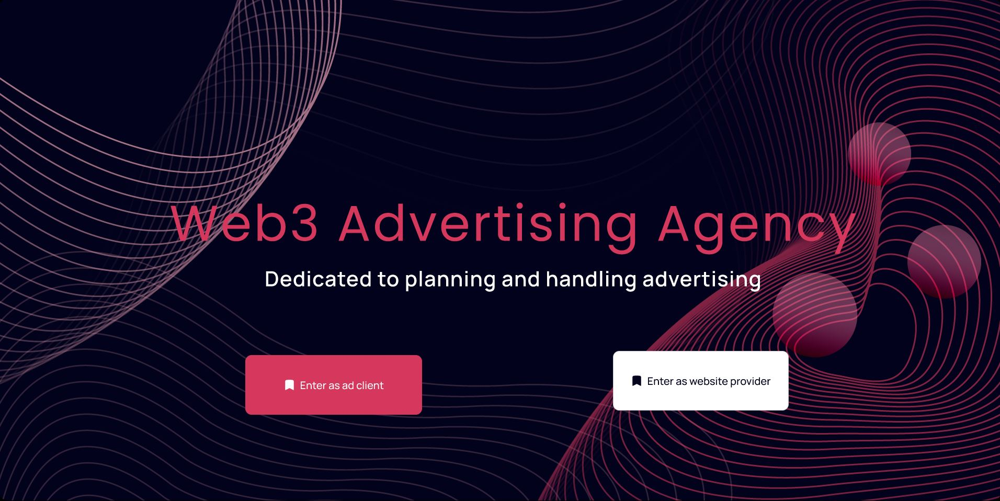
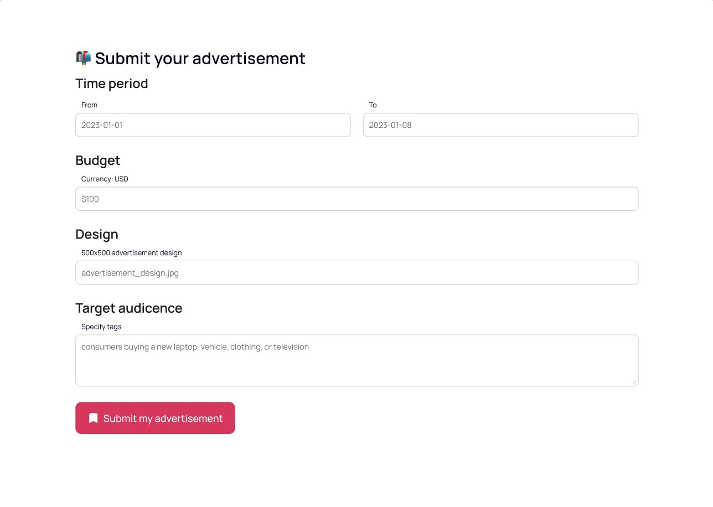
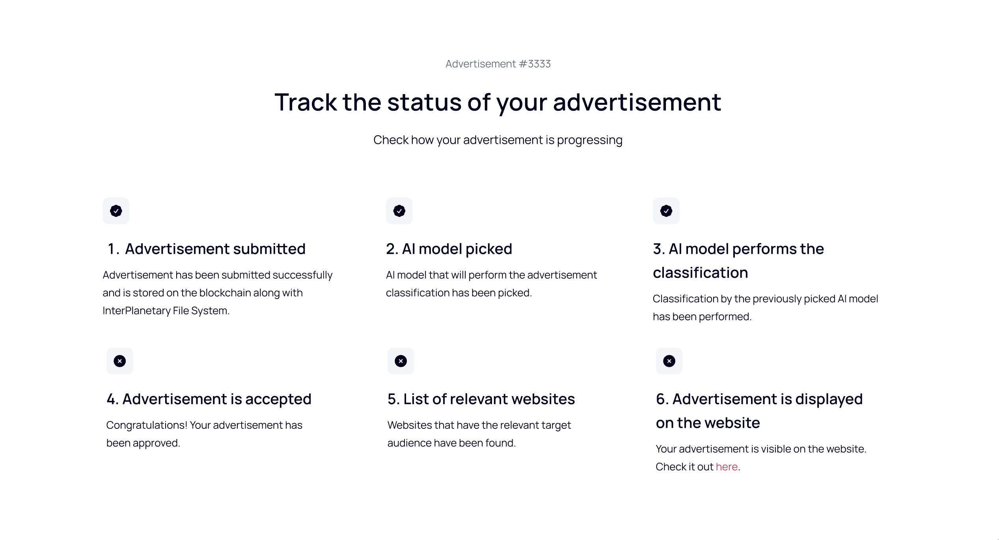
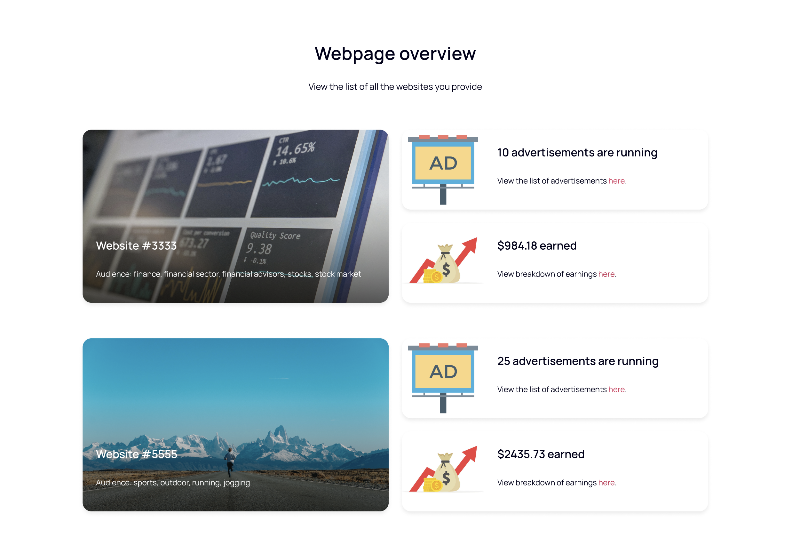
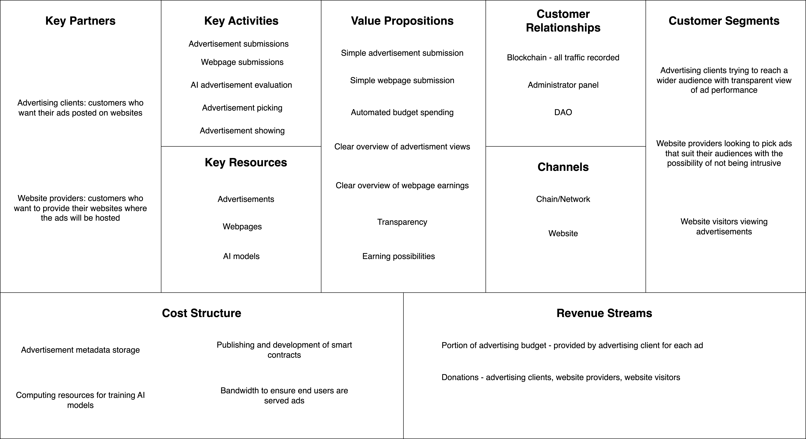

# Web3 Advertising Agency Whitepaper

### Žan Kogovšek

### zk0821@student.uni-lj.si

### Miha Krumpestar

### mk2376@student.uni-lj.si

```
March 20, 2023
```
## 1 Application Idea

The application is a Web3 advertising agency that will utilize DID methods, concept of a marketplace, knowledge
management infrastructure and blockchain to provide its services. Clients will be able to provide ad designs,
budget, target audience and time range for the ad campaign to be active. Providers will be able to provide
website where the ads from clients would be displayed. Visitors will then be able to either block ads or view them
as normal. If the visitor were to view ads as normal both the visitor and the website provider would earn some
of the budget the ad campaign offers. The visitor will get a share of revenue as he is the one viewing ads, but he
can also choose to donate it to the website provider. Visitor will be able to completely turn off ads, in which case
a small portions of his own money will be paid to the provider he visits.

## 2 Application Design

The application design is available on Figure 1 and is split into seven distinct parts. Firstly, we have the
Decentralized Identifier (DID), which will help our application to verify its users. Three types of users are defined
for the application, two of which require identification. The first is the client, which will provide the ad it wants
to be published, and the second is the provider, which will provide the website, where the ad will be shown. The
last type of user is a visitor, who visits the provider’s website and views the client’s ads. The second part of the
application involves ad submissions. The client will provide the ad design, time period of advertising, budget for
the campaign and the target audience. This data will be stored on the blockchain and bigger files - like photos
will be kept on the InterPlanetary File System (IPFS). Next, the AI reviewers are notified about the new ad
and one of the available models is asked to perform the ad analysis and classify the ad as either appropriate or
inappropriate. The client is later notified about the choice. Website providers also submit their web page and the
type of audience that visits the website. An automated check is performed to determine the suitability of the web
page along with an estimation of the number of website visitors. Website providers will then be able to choose
the ad layout they like best and choose ads to show from a list of ads that suit the website. Website visitors will
be prompted to choose whether they would like to view ads or block them. In the first case part of the ad budget
is split between the website provider and the visitor. If a visitor decides to block the ads they are charged a fee,
which is given to the website provider. If visitors decide to view ads they are also able to give feedback which will
later be given to ad clients and AI models that classified the ad in order to train it in making better decisions.


```
Figure 1: Application Design Diagram
```

### 2.1 Concept of a marketplace

The marketplace would be primarily designed for website owners. They will be able to select/install ad layouts,
styling and interactions based on the website theme and their preferences. Each item will have a unique ID, which
the website owners can use to embed into their website. Their revenue is based on visibility, position and size.
This will be verified with JavaScript code on client’s end. The user/customer on the website won’t need anything
to interact with the ads, but the ads can know the user’s field of view and location of the mouse pointer, if the
website owner enabled it. The ads can already contain contracts, with which user can interact with, that is also
dependent on the website owner. Marketplace will be governed with a DAO and any reputable ad or website
owner will be able to provide suggestions.

### 2.2 Knowledge management infrastructure

Knowledge management infrastructure will be used to train and evaluate AIs for ad approvals. AI will match ad
and website based on intelligence and ad audience. It will also enable to find and contain anomalies that might
appear by malicious actors. It will provide a way for the client to bid on specific target audience, which will
provide more revenue for website providers. We haven’t decided on any specific knowledge graph provider (eg.
Neo4j, OriginTrail) that will be linked to blockchains.


### 2.3 Proofs for every important requirement

AI models will determine the adequacy of the ads that will later be displayed on websites of the providers. In
order to provide the best possible quality of this classification, users will be prompted to determine whether AIs
are ok and rank them. This can be thought of as a reputation model, which can in turn serve as a proof of AI’s
proper classification abilities.

## 3 Wireframes

```
Figure 2: Landing page
```

```
Figure 3: Submitting an advertisement
```

```
Figure 4: Status of an advertisement
```

```
Figure 5: Webpage overview
```

## 4 Key software components and tasks for implementation

### 4.1 Key components

4.1.1 Decentralized Identifier

Decentralized Identifier will take care of verifying the users of our application. This includes the clients, who will
provide the ads and the providers whose websites will host the ads. This will ensure the user is actually the person
they are portraying to be.
List of APIs:

- [POST] did/verifyis an endpoint that will verify user interacting with the application.


4.1.2 Advertisement Smart Contract

Advertisement Smart Contract will handle everything ad related. Clients will be able to send ad metadata to the
contract, which will store bigger files on IPFS and the smaller metadata on the blockchain. This smart contract
will also handle all the payments. When the client will send ad metadata, the budget will be sent as well. This
budget represents the ad campaign and will be paid out to both visitors and website providers. In case the ad
is rejected by the AI model, all the budget is returned to the client. Smart contract for ads will also keep track
of feedback that is given by the visitors of the website, which will later be given to the ad client and AI models.
Advertisement Smart Contract will also be used for payouts. In the case when the visitor decides to view the ads,
some of the budget for the ad campaign is split between the visitor and the website provider. However, if the ad
is blocked, then the provider is paid by the visitor.
List of APIs:

- [POST] advertisement/submitis an endpoint that will receive ad submissions.
- [GET] advertisement/idis an endpoint that returns the ad information to be displayed on the website.
- [GET] advertisement/listis an endpoint that returns all ads and allows filtering of results.
- [GET] advertisement/id/hideis an endpoint that blocks the ads on the page.
- [GET] advertisement/id/showis an endpoint that shows the ads on the page.
- [GET] advertisement/id/payis an endpoint that pays the website provider (and visitor).

4.1.3 Website Smart Contract

Website Smart Contract will be used by website providers. They will send website information to the smart
contract, which will store all the available websites where the ads will be displayed. Providers will also be able to
choose the layout for the ads, which will be stored in the contract as well. After the website provider has picked
the ad to be displayed on the website, this is registered on the blockchain as well.
List of APIs:

- [POST] website/submitis an endpoint that will receive website submissions.
- [GET] website/idis an endpoint that returns the website registered underid.
- [GET] website/listis an endpoint that returns all websites and allows filtering of results.
- [POST] website/advertisement/registrationis an endpoint that registers the advertisement that will
    be displayed on the website along with the layout it will use.

4.1.4 AI models for ad classification

AI models will be used in the process of advertisement review. Once an ad has been submitted, one of the available
AI models will perform the classification of the advertisement and determine if it meets the quality control and is
appropriate to be displayed on websites of the providers.
List of APIs:

- [POST] ai/classificationis an endpoint that will receive ad metadata and perform the classification.

4.1.5 Frontend

A suitable user interface is needed in order to provide ease of use for all previously mentioned APIs. Frontend
should also provide easy lookup into currently running ad campaigns for clients and earnings for website providers.


### 4.2 Key technologies

4.2.1 Ganache

Ganache is a personal blockchain that allows developers to test and deploy Ethereum smart contracts in a local
development environment. It is widely used by blockchain developers to build and test decentralized applications
(dApps) before deploying them to the Ethereum mainnet or testnet.
Primary reasons for choosing Ganache:

- Speed and convenience: Ganache allows developers to quickly set up a local blockchain network with minimal
    configuration. This can greatly speed up the development process and make it more convenient for developers
    to test their code.
- Control and customization: Ganache provides developers with complete control over their local blockchain
    network, allowing them to customize various settings such as the number of accounts, gas limits, and block
    times. This can help developers simulate different scenarios and test their smart contracts under various
    conditions.
- Debugging and testing tools: Ganache comes with a range of tools that make it easier for developers to
    debug and test their smart contracts. These tools include a built-in debugger, a console for interacting with
    smart contracts, and support for automated testing frameworks like Mocha and Chai.
- Multiple accounts: Ganache comes with multiple Ethereum accounts preloaded with Ether, allowing devel-
    opers to test their contracts with different accounts and simulate real-world scenarios.

This technology will allow us to build smart contracts safely. We will be able to easily test if they function
correctly.
Setup is trivial as Ganache providers an installer for all operating systems.

4.2.2 IPFS (InterPlanetary File System)

IPFS allows users to store, share, and access files and data in a decentralized manner, without relying on a
centralized server or storage system.
In IPFS, files and data are addressed by their unique content-based hash instead of their location on a particular
server or device. When a user requests a file, the IPFS network uses a Distributed Hash Table (DHT) to locate
the closest peer that has the requested content and downloads it from multiple peers in parallel, providing faster
and more resilient access to the file.
We will use IPFS to store advertisements and later show them on websites the providers will offer.
Setup for local IPFS uses Docker to create a local IPFS cluster.

4.2.3 Decentralized Identifiers (DIDs)

Decentralized Identifiers, or DIDs, are a new type of identifier designed to enable digital entities, such as people,
organizations, and devices, to have a unique, globally resolvable identifier that is under their control and not tied
to any specific centralized authority.
We will be using the implementation of DIDs made byOwnYourData, which offers a Docker container for easy
integration. This DID implementation consists of two main components: the DID Registry and the DID Resolver.
The first stores and manages the DIDs of all users on the platform. Meanwhile the second component can resolve
a DID URL to a DID document, which contains metadata associated with the user’s identity.
We will be using DIDs to verify advertising clients and website providers. This will ensure that only the
owner of an advertisement or a website will have access to sensitive information regarding advertising campaigns
or website earnings and ad placements.
As stated before OwnYourData provides a Docker container where both the DID Registry and DID Resolver
run.


4.2.4 TensorFlow

TensorFlow is an open-source software library developed by Google for numerical computation and machine
learning. It is designed to enable developers to build and train deep learning models quickly and easily, using a
high-level API that abstracts away many of the lower-level details of neural network programming.
We will use TensorFlow to build a machine learning model that can classify advertisements. For this we will
first need a dataset containing labeled advertisements including both positive and negative cases. Once the model
is trained, we will use it to classify advertisements that the advertising clients will send.
TensorFlow is a widely used package in Python and as such is not complex to install or use.

### 4.3 Data schemas & models

For transferring data between different components of our applications mainly JSON and binary streams will be
used, but after data reaches the final component it will be in the format the component requires. These are
described below for each major component of our application separately.

4.3.1 Ethereum Smart Contracts

When communicating with Ethereum smart contracts, the data schema/model used is the Ethereum Contract
Application Binary Interface (ABI). The ABI specifies the format of data that is passed between an Ethereum
contract and its callers, which can include other smart contracts or external applications.
The ABI defines how function signatures and parameters are encoded in the binary data format that is sent to
and received from a smart contract. It also defines how data types, such as integers and strings, are represented
in the binary format.

#### 4.3.2 IPFS

IPFS uses a content-addressable data model/schema.
In IPFS, files are identified and accessed based on their content, rather than their location or path on a
specific server or device. Each piece of data or content in IPFS is assigned a unique content-based identifier called
a Content ID (CID), which is derived from the content itself using a cryptographic hash function.

4.3.3 TensorFlow

TensorFlow uses a data model/schema called tensors to represent data in its machine learning computations.
In TensorFlow, a tensor is a multi-dimensional array or matrix that can represent a wide range of data
types, including integers, floating-point numbers, and strings. Tensors are the fundamental data structure used in
TensorFlow’s operations and computations, and they can be passed between different layers of a neural network
or between different components of a machine learning pipeline.

#### 4.3.4 DID

The DID uses a data schema/model that is basically a string of characters, which is unique and resolvable.

### 4.4 Functional & non-functional requirements

These are the main functional requirements:

- The ad providers should be able to submit ads using UI or API.
- Ads should not interfere or prevent the visitor from interacting with the website.
- Ads should be validated by AI.
- DAO can invalidate AIs and ads, that it seems they need replacement or to be removed.
- Token system for ad providers to pay and website owners and visitors get paid.


- Website owners should be able to select ad audience and ad layout for their website.
- Website visitors should be able to block ads if they provide compensation or flag ads as inappropriate or
    misleading.
- All participants (except website visitors) should be easily identifiable.

These are the main non-functional requirements:
- Ads should load within 0.5 seconds.
- Ads should be relevant to the website.
- Ads should be appropriate.
- Our website should allow easy ad submission and overview of the gathered/reported user-data.
- The system should be able to handle 100,000 websites and 100,000,000 website visitors.
- Unhackable system.

### 4.5 Soft & hard requirements (key functionalities)

These are our hard (must have) requirements:

- Website where the ad providers can submit ads.
- Serving ads on the website.
- Token system, where the website owner gets his share of the ad revenue.
- Payment system for the advertising client.
- Identification system for advertising clients and website providers (IDs).

These are our soft (nice to have) requirements:

- User is able to flag the ad as inappropriate or misleading.
- All ad slots on the website should be populated.
- Ad requests of timespan and audience will be fully fulfilled.
- Ad provider should be able to cancel ad request.
- Ads should not be taken down.
- Token system, where the website visitor gets his share of the ad revenue.
- Bidding system, so the website providers can compete for the ad space.
- Gathering/reporting user-data.
- DAO in charge of the AI and appropriate ad applications.
- AIs for ad classification and appropriate use.

### 4.6 Repository

Access to the repository: https://github.com/mk2376/ad-agency


## 5 Business model canvas

### 5.1 The Selling Point

The main selling point of our solutions is the transparency and flexibility we provide for our users. Transparency
is provided with DID identifiers and contracts stored on the blockchain, while offering immense control for all
involved parties, those are website owners, providers and clients. We will be offering a product practically without
any disadvantages for any party, so the users won’t have any negative preconditions like in the current system.
To explain more in detail: clients won’t be left with the ”bad taste”, they have been experiencing today, that is
having to view ads that are inappropriate, without possibility to reject or complain and without ability to identify
the bad actor (providers). Providers will be able to get a real price of ads on the market without manipulation
and transparent user feedback. Website owners will finally be able to whitelist or blacklist providers, categories
and content, that will be displayed on their website.

### 5.2 Users Onboarding

In order to provide the easiest possible onboarding process for new users, the process for ad submission will be
very similar to existing solutions. Advertising clients will be able to pick an image for the advertisement along
with the target audience, time range for the advertisement and the budget for the ad campaign. At the moment of
submission, the budget will be deducted from the client’s account in the form of cryptocurrency and be locked in
a smart contract. The client will be able to track the status of the advertisement, and after it has been confirmed
and is hosted on a website, the client will also be able to see the number of views the advertisement is receiving.
Website providers will go through a similar process, which will be made as simple as possible in order to get
as many website providers as possible, so we can start showing advertisements immediately. The process will
involve specifying the website URL and the type of audience the website brings in. The website owner will also be
required to inject our custom JavaScript source file into their website. This way we can confirm they are indeed
the owner of the website, and we can begin with showing advertisements on the provider’s website. After the
website is confirmed, the provider can choose an ad layout of their choice and choose an ad that matches the type
of audience the website brings in. After that is done, the advertisement is visible to visitors on the website.
Visitors will be prompted at the website visit whether they want to view the advertisement or not. If they
choose to view the advertisement, a small portion of the advertising budget is given to the visitor and at the same
time the website provider is also given a cut. This way, the ads will not be as intrusive and the onboarding process
will be pleasant for all parties involved.


### 5.3 Table

```
Figure 6: Business Model Canvas Table
```

### 5.4 QA

5.4.1 Key Partners

```
Q: Who are our key partners?
```
```
A: We would primarily partner with website owners (providers), as well as ad orderers (clients).
```
```
Q: Who are our key suppliers?
```
```
A: Main suppliers would be providing storage (for storing ads, IPFS in our case), compute (AI) and transmission
(ad push to client).
```
```
Q: Which key resources are we acquiring from partners?
```
```
A: Our partners will provide both the advertisements and the websites where the aforementioned advertisements
will be shown.
```
```
Q: Which key activities do partners perform?
```
```
A: Partners will be submitting advertisement and website data through smart contracts.
```
5.4.2 Key Activities

```
Q: What key activities do our value propositions require?
```
```
A: Main activities would be (in order):
```
```
(a) Companies add ad orders through website or blockchain with payment.
(b) AI then evaluates ads and checks classifications provided with order.
```

```
(c) On approval, ad contract gets deployed. Depending on market conditions (bets from other companies)
ad might not be as visible if it wasn’t paid enough or may be not shown at all.
(d) With all previous preconditions met, ad will be served to clients upon website visits.
```
```
Q: What are our distribution channels?
```
```
A: Distribution would be taken care of by our chain/network, provided by our providers. We would potentially
accept individuals or groups in extending our network. They would of course get part of our commission.
```
```
Q: What about customer relationships?
```
```
A: Customer relationships will be taken care of by a DAO, a lot of work would be also done by AI (ad
evaluations).
```
```
Q: What are our revenue streams?
```
```
A: We would get revenue from commissions, as well as the bidding system.
```
5.4.3 Value Propositions

```
Q: What value do we deliver to the customers?
```
```
A: Customer gets a clear and simple control over ads on his website, as well as larger* profits from visitors.
While the ad orderer gets a clear overview on market conditions, with more options to interact with visitors.
(*estimated based on web2)
```
```
Q: Which one of our customer’s problems are we helping to solve?
```
```
A: Many customers today are unhappy on how large ad networks handle ads, as they can’t restrict their type
nor price.
```
```
Q: What bundles of products and services are we offering to each customer segment?
```
```
A: To clients we are offering websites where their advertisements will be hosted. To providers we are offering
ads, which can earn them money.
```
```
Q: Which customer needs are we satisfying?
```
```
A: We are satisfying many customer needs one of which istransparency. Clients will be able to see where
and for how long their ad has been posted and how many people were exposed to it.
```
5.4.4 Customer Segments

```
Q: For whom are we creating value?
```
```
A: We are creating value for website providers, advertising clients and finally end customers (visitors)
```
```
Q: Who are our most important customers?
```
```
A: Both website providers and advertising clients are important for our business model as one does not work
without the other. This makes them both of equal priority.
```
5.4.5 Channels

```
Q: Through which channels do our customer segments want to be reached?
```
```
A: Our customers will be reached via our chain/network through smart contracts. Direct customer relationships
will be taken care of by a DAO. (Already explained in Key Activities)
```

5.4.6 Key Resources

```
Q: What key resources do our value propositions require?
```
```
A: We require advertisements and websites, where the advertisements will be posted. (Already explained in
Key Partners)
```
```
Q: What key resources do our distribution channels require?
```
```
A: We require an active chain/network with support for smart contracts.
```
```
Q: What key resources do our distribution channels require?
```
```
Q: What key resources do customer relationships require?
```
```
A: We require a DAO to be established.
```
```
Q: What key resources do revenue streams require?
```
```
A: We require a chain/network with support for payable smart contracts (Funds can be transferred between
different accounts when certain conditions are met)
```
5.4.7 Cost Structure

```
Q: What are the most important costs inherent in our business model?
```
```
A: The biggest cost will be the bandwidth to serve and store ads (on IPFS), as well as computing resources to
train and use AIs. Publishing and development of smart contracts will also require funding.
```
```
Q: Which key resources are most expensive?
```
```
A: Some of the money will probably be spent on the DAO, too, as we want an engaging community. The
majority, however, will be spent on, as mentioned previously, evaluating ads and storing them.
```
5.4.8 Customer Relationships

```
Q: What type of relationship does each of our customer segments expect us to establish and maintain with
them?
```
```
A: As we want an active community a DAO needs to be established and communication and interaction should
happen in connection with the DAO. Website providers and advertising clients can expect a transparent
relationship where all the information is publicly available for their viewing (ad views, earnings, ...)
```
5.4.9 Revenue Streams

```
Q: For what value are our customers really willing to pay?
```
```
A: Customers will pay for their ads to be posted on websites with matching target audience. They will not
need to pick the websites themselves, but will just launch the campaign and everything else will be taken
by our internal system and website providers.
```
```
Q: For what do they currently pay?
```
```
A: Advertising on a single website and limited transparency.
```
```
Q: How are they currently paying?
```
```
A: Per time range (how long an ad is shown) with credit card (or other forms of online payment)
```
```
Q: How would they pay with our business model?
```
```
A: Along with the ad submission an ad budget would need to be specified and that money will be locked inside
the smart contract. While the website provider is hosting the advertisement and visitors are viewing it the
ad budget would slowly be released to both the provider and the visitor. Payments would therefore be done
through cryptocurrency.
```