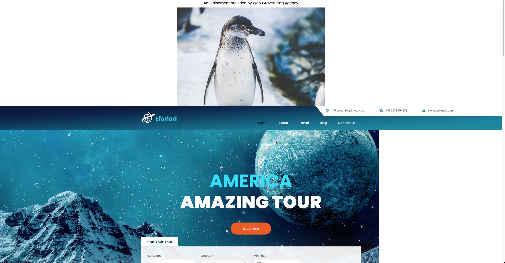

# Ad-Agency DAPP

## Instructions

Run the development server:

```bash
make run
```

Deploy:

```bash
make build-deploy
```

Open [http://localhost:3000](http://localhost:3000) with your browser to see the result.

## Pages

### First page


### Connect Wallet page


### Visitor page


### Client Overview Page


### Submit Advertisement page


### Advertisement List Page


### Advertisement Details Page


### Provider Overview Page


### Provider Submit Page


### Provider List Page


### Website Details Page


### Sample Page with Advertisement


